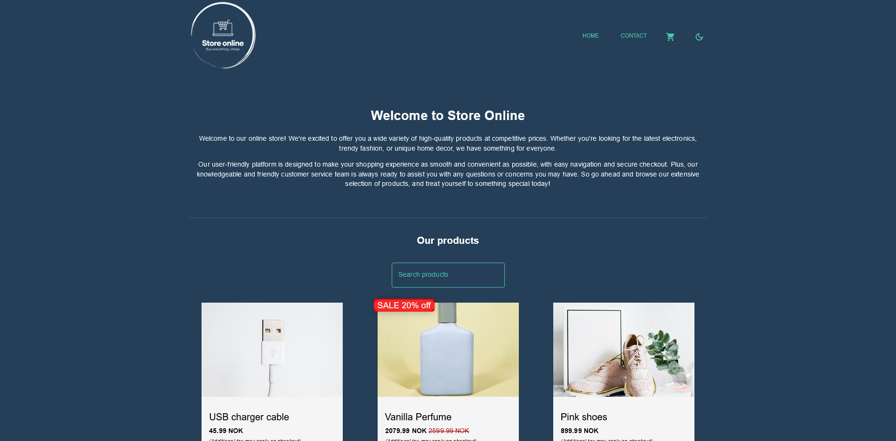

# Course assignment JavaScript Frameworks


This project is based on course assignment during JavaScript framework class at Noroff to apply knowledge of React to build an eCom store.

## Brief

The API you are using for this brief is: <https://api.noroff.dev/api/v1/online-shop>
You can find individual items by appending a product ID at the end of the API URL e.g. <https://api.noroff.dev/api/v1/online-shop/f99cafd2-bd40-4694-8b33-a6052f36b435>
You are tasked with build out the following pages for an eCom store:

1. Homepage
2. Individual product page
3. Cart page
4. Checkout success page

The Homepage should have a list of all the products. There should be a look-ahead search bar that filters products when typing in a product name. Clicking on a product should take a user to an individual product page.

You pages should use a `<Layout>` component that contains a header and footer. The header should contain a nav bar as well as a Cart icon component that acts as a button as well as displays the current number of items in the cart.

The individual product page should display data for a single product. There should be an Add to cart button which, upon clicking, adds the product to the cart. The product page should display the title of the product, the description and the image. There should also be reviews listed for the product, if there are any. You should use the discountedPrice property to display the price of the product. If there is a difference between the discountedPrice and price properties then that means there is a discount for that product. Calculate what this discount is and display it on the page.

Clicking on the Cart icon will load the Cart page, which will list all of the products as well as a total. The Cart page will have a Checkout button. Clicking this Checkout button then goes to a Checkout success page.

The Checkout success page will display a message to the user notifying them that their order was successful. There should also be a link that lets a user go back to the store. The cart must be cleared if the user gets to the Checkout success page.

There will be a contact page which will contain a contact form with the following fields. There must be form validation:

1. Full name (Minimum number of characters is 3, required)
2. Subject (Minimum number of characters is 3, required)
3. Email (Must be a valid email address, required)
4. Body (Minimum number of characters is 3, required)

You will be using React Router to switch between pages.
Your design should be responsive. You are welcome to use a CSS Framework, however, you’re encouraged to design from scratch and use styled-components or CSS Modules.
You are not required to use TypeScript.
Your code is expected to be clean and well-formatted.

## Installation

To start this project you will need to clone the project. After the project is cloned to your device run:

```md
 npm i
```

To start local server for development run:

```md
 npm run start 
```

To create a build of this project run:

```md
 npm run build
```

### Author

This project is created by Christopher Tønnesland

**Contact information**

<div style="display: flex; gap: 15px; flex-wrap: wrap;">
<a href="https://github.com/christonn"></a>
<a href="mailto:christopher.tonnesland@gmail.com"></a>
<a href="https://wa.me/+4745481637"></a>
<a href="https://linkedin.com/in/christopher tønnesland"></a>
<a href="https://www.facebook.com/7oSkaaa"></a>
</div>
